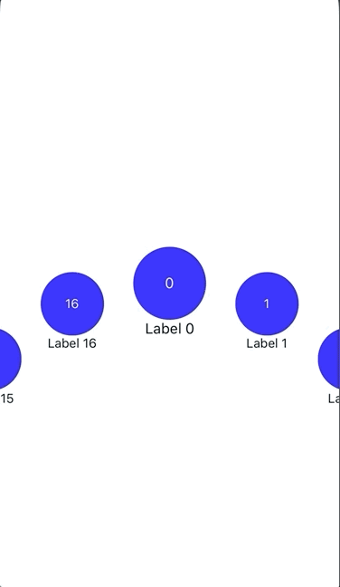

# react-native-circle-list

### Description

A React Native component implemented in Javascript to create a circular list of elements, with infinite scroll. Data is mapped onto a fixed number of elements, so no matter how long your list is, it will appear be render in the given circle size.



### Installation

```sh
$ yarn add react-native-circle-list
$ npm install react-native-circle-list
```

### Props

| Prop                  | Default                   | Description                                                                                                                                 | Required |
| --------------------- | ------------------------- | ------------------------------------------------------------------------------------------------------------------------------------------- | -------- |
| containerStyle        | undefined                 | Overide default container styling.                                                                                                          | No       |
| data                  | []                        | Array of objects, similar to React Native's FlatList.                                                                                       | Yes      |
| elementCount          | 12                        | Number of elements that form the circle.                                                                                                    | No       |
| initialRotationOffset | 3 \* PI / 2               | Inital rotation of list in radians. Default value causes index 0 to be centered.                                                            | No       |
| keyExtractor          | undefined                 | Function to extract list item keys from dataset, similar to React Native's FlatList                                                         | Yes      |
| radius                | 1.2 \* <screen-width> / 2 | Radius of the circle form by the list elements.                                                                                             | No       |
| renderItem            | undefined                 | Function to that returns a React Componet or elements to render, similar to React Native's FlatList.                                        | Yes      |
| selectedItemScale     | 1.15                      | Scaling factor for the selected item.                                                                                                       | No       |
| swipeSpeedMultiplier  | 40                        | Postive number to customize how quickly the list rotates in response to a gesture. A higher number means more movement for a given gesture. | No       |
| visiblityPadding      | 3                         | How many elements to show on either side of the selected element.                                                                           | No       |

### PRs Welcome!
